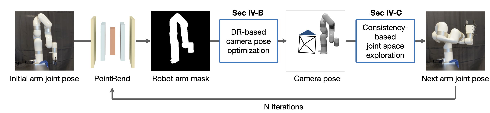

# EasyHeC: Accurate and Automatic Hand-eye Calibration via Differentiable Rendering and Space Exploration

### [Project Page](https://ootts.github.io/easyhec) | [Paper](https://arxiv.org/abs/2305.01191)

This project contains the implementation of our EasyHeC paper.

Authors: [Linghao Chen](https://ootts.github.io), [Yuzhe Qin](https://yzqin.github.io/), [Xiaowei Zhou](https://xzhou.me/), [Hao Su](http://ai.ucsd.edu/~haosu/).



## Update

- (2023.7.11) New prompt drawer for SAM has been supported! Checkout the newest code for more accurate results without training the PointRend!
- (2023.7.13) Franka Emika robot has been supported! See [here](docs/usage.md#6-add-franka-emika-robot-support) for details. Thanks to [Minghao Liu](https://github.com/Learner209) for contribution! 

## Requirements

- Ubuntu 18.04+
- Python 3.7+
- Nvidia GPU with mem >= 10G
- PyTorch 1.11.0+
- GCC<10 (may vary depending on your cuda version)

## Install

See [install.md](docs/install.md)

## Usage
See [usage.md](docs/usage.md)

## Citation

If you find this code useful for your research, please use the following BibTeX entry.

```
@article{chen2023easyhec,
  title={EasyHec: Accurate and Automatic Hand-eye Calibration via Differentiable Rendering and Space Exploration},
  author={Chen, Linghao and Qin, Yuzhe and Zhou, Xiaowei and Su, Hao},
  journal={arXiv preprint}, 
  year={2023}
}
```

