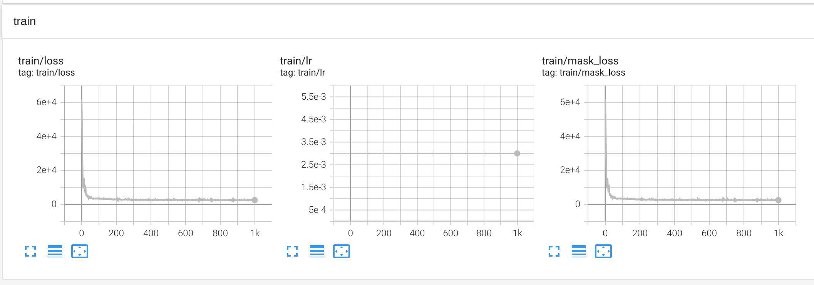
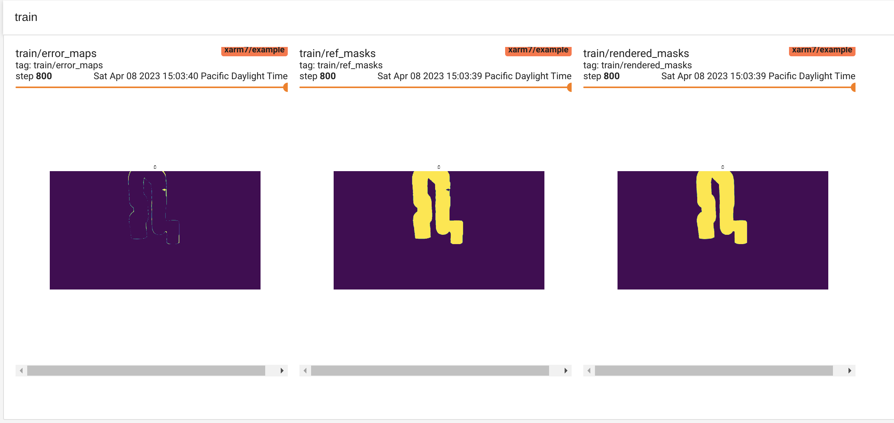
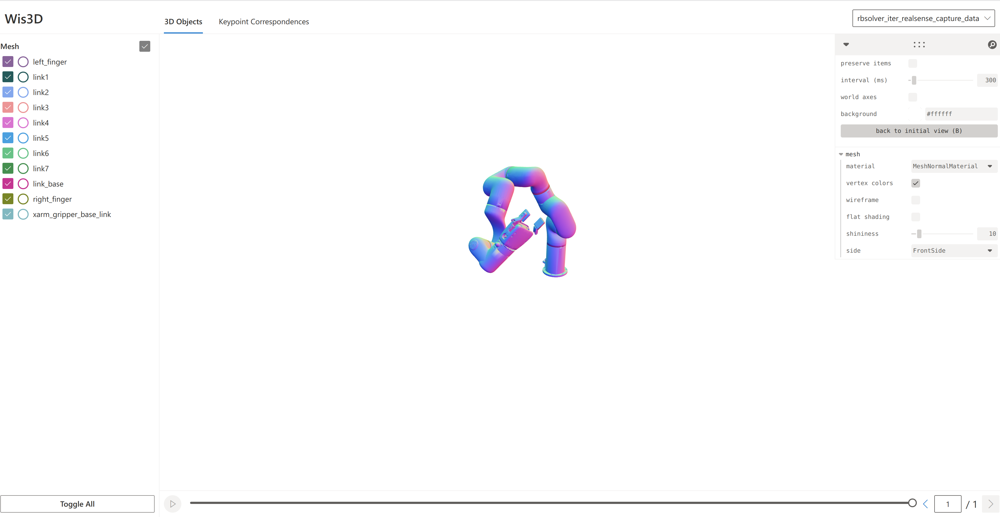
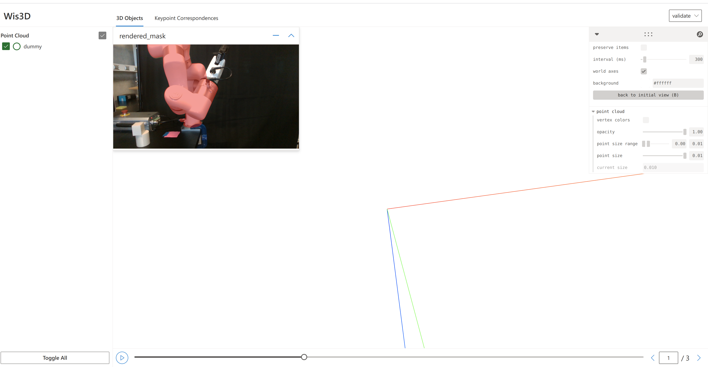

## Notes:

1. Currently, we only support XArm7 and realsense without distortion parameters. To support other cameras or other robot arms, see [custom.md](custom.md).
2. We strongly recommend to put a curtain of different color from the robot arm.

### 1. Download checkpoints.

```bash
# Setup pvnet data and models
mkdir -p third_party/pvnet/data/model/pvnet/xarm7
gdown 1g3QmrQsQPsKM3bSktv4UVCDhRRzM0m9r -O third_party/pvnet/data/model/pvnet/xarm7/

# Setup detectron2 data and models
mkdir -p third_party/detectron2/projects/PointRend/models/xarm7_finetune/
gdown 1iDBcTLMWJUUjyJ5F6a8OH373tKbDUk3o -O third_party/detectron2/projects/PointRend/models/xarm7_finetune/
```

### 2. Setup tensorboard and Wis3D.

Although our method is automatic, we **strongly** recommend users to monitor the optimization process with TensorBoard to ensure the correctness and the joint space exploration process with [Wis3D](https://github.com/zju3dv/Wis3D) for safety.

```bash
# Open a new terminal and start TensorBoard server
tensorboard --host localhost --logdir models
# Open a new terminal and start Wis3D server
wis3d --vis_dir dbg --host localhost
```

Then open [localhost:6006](localhost:6006) and [localhost:19090](localhost:19090) in browser.

### 3. Model the environment point cloud.

Users **must** model the environment or the space where the robot arm is working to avoid collision. We provide an example at [here](easyhec/modeling/models/rb_solve/workspace_boundary.py) for conveniently visualize the modeled environment with Wis3D.

### 4. Run EasyHeC!

```bash
python tools/run_easyhec.py -c configs/xarm7/example.yaml
```

1. During optimization, you should be able to observe: 1) the mask loss converging in less than 1000 iterations in the [Scaler panel](localhost:6006/scalars) and 2) the difference between the rendered mask and the reference mask (predicted from PointRend) decreasing in the [Image panel](localhost:6006/images). An example is visualized below.





2. After each space exploration step, we **strongly recommend** users to visualize the next joint pose in [Wis3D](http://localhost:19090/?tab=3d&sequence=rbsolver_iter_realsense_capture_data) for safety consideration. After making sure the next joint pose is safe, press `Enter` to drive the robot and perform the next optimization iteration .

   


### 5. Validate the optimization results.

1. Validate the camera pose by visualizing the alignment between rendered masks and captured RGB images. Run the following command and visualize the result in Wis3D.

   ```bash
   python tools/validate.py
   ```

   

2. Capture a new set of RGB images with some new joint poses, and validate the camera pose on these new images.

   ```python
   python tools/validate.py --data_dir DATA_DIR
   ```
   
   
### 6. Add Franka Emika robot Support

1. Before running it on Franka, you may need to read the [tutorial](https://ros-planning.github.io/moveit_tutorials/doc/move_group_python_interface/move_group_python_interface_tutorial.html) here to have a more clear view of manipulating Franka in `ROS` and `MoveIt`.
1. We initialize the camera pose by running [easy_handeye](https://github.com/IFL-CAMP/easy_handeye) in cope with `ROS` and `MoveIt`. After finishing the camera caliberating procedure, modify the initial camera pose in the [example_franka.yaml](../easyhec/config/defaults_franka.py#L130).
1. Offline franka solution: Running franka online may be complex, so we had added an offline solution to calibrate franka. Please refer to [franka_offline.md](franka_offline.md).

